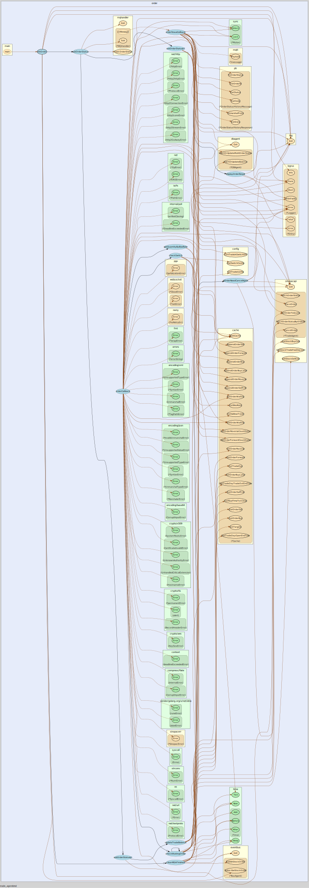

# TRADE AGENT

## Features

[API Docs](http://trade-agent.tocraw.com:16670/swagger/index.html)

### Module Features@2022.01.03

#### Init

- 確認執行檔路徑，並儲存於 `global-Setting-BasePath`
- 由環境變數 `DEPLOYMENT` 確認是否開發環境
  - `docker` 則為開發環境

#### Tasks

- 由 config 中讀取 cron 初始化以下 tasks
  - `CleanEvent`
  - `RestartSinopac`

#### SinopacAPI

- 與 `sinopac_mq_srv` 通訊
- 由 config 中讀取 host, port，並初始化 `AskSinpacMQSRVConnectMQ`, `FetchServerToken`

#### Routers

- API Server

#### MQHandler

- 由 config 中讀取 `mqtt` host, port, username, password
- 建立 `trade_agent_mqtt` 連線
- 無法建立連線則會 lock

#### TradeDay

#### TickProcess

#### Targets

#### Subscribe

#### Stock

#### Order

#### History

#### HealthCheck

#### CloudEvent

#### DBAgent

### Order Module

## Authors

- [**Tim Hsu**](https://gitlab.tocraw.com/root)
