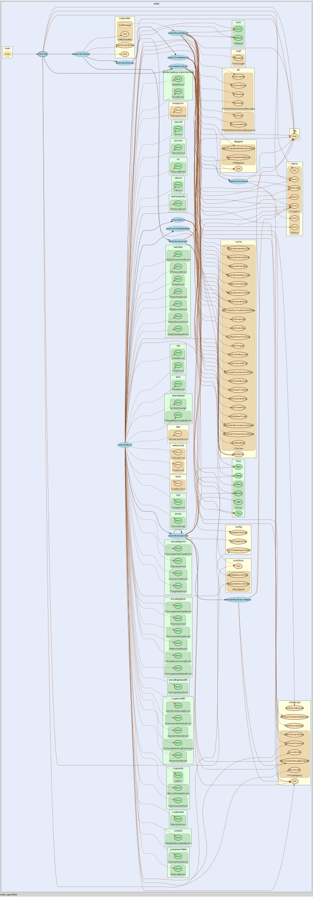

# TRADE AGENT

[](https://gitlab.tocraw.com/root/trade_agent/-/commits/main)
[](https://gitlab.tocraw.com/root/trade_agent/-/commits/main)
[](https://gitlab.tocraw.com/root/trade_agent)
[](https://golang.org)
[](https://www.linux.org/)
[](https://www.docker.com/)

## Features

[API Docs](http://trade-agent.tocraw.com:16670/swagger/index.html)

### Git

```sh
git fetch --prune --prune-tags origin
git check-ignore *
```

### Trade Agent Module



## Authors

- [**Tim Hsu**](https://gitlab.tocraw.com/root)
